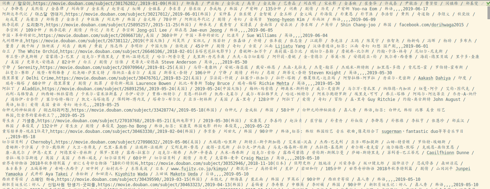

豆瓣导出工具

工具包含 Python 版本和 JavaScript 版本。

## Python
Python 版本基于 Python 3.6.x ，其他版本暂未测试。

主要实现:

- 电影导出
- 书籍导出
- 音乐导出
- 日记导出

关于豆瓣相册导出可以参考我 [这个](https://github.com/einverne/douban-dl) 项目。

## JS

userscript 主要来自于

- douban-book-export.user.js
- douban-movie-export.user.js

分别来自于：

OpenUserJS

- <https://openuserjs.org/scripts/KiseXu/%E8%B1%86%E7%93%A3%E7%94%B5%E5%BD%B1%E5%AF%BC%E5%87%BA%E5%B7%A5%E5%85%B7/source>

DannyVim

- https://raw.githubusercontent.com/DannyVim/ToolsCollection/master/douban_book.js

## reference

- <https://github.com/chishui/douban-movie>

